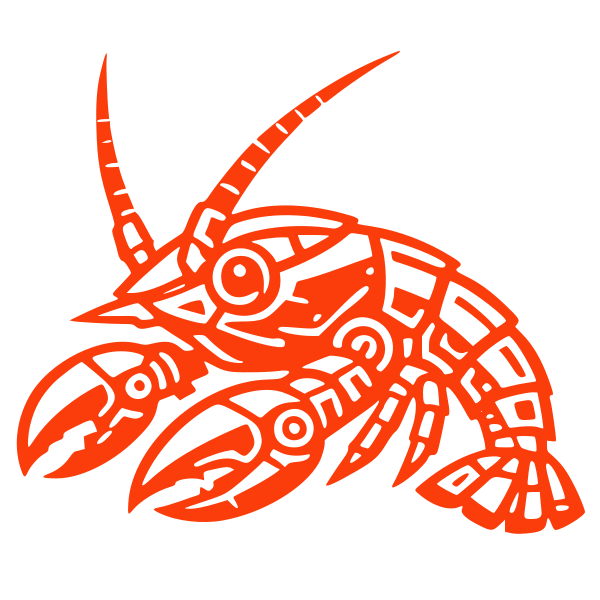
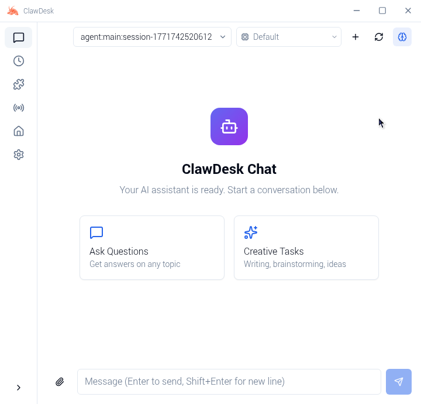
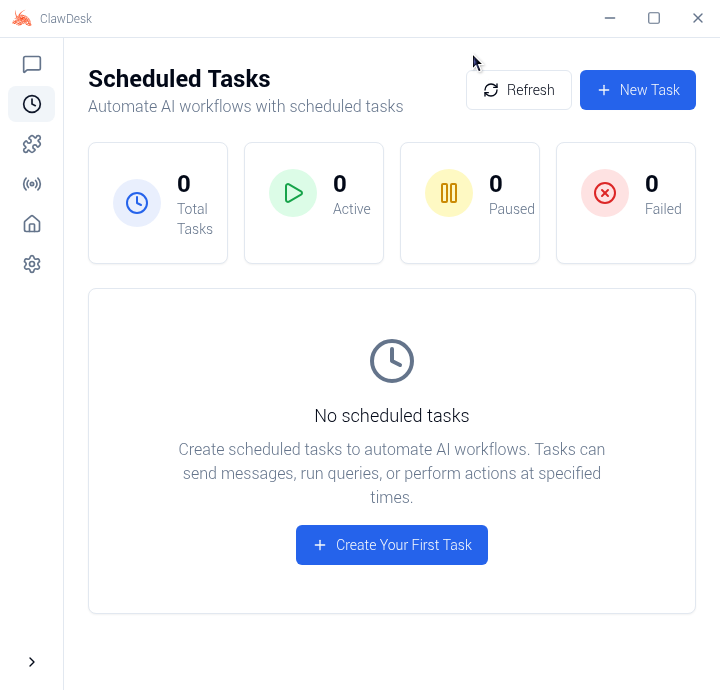
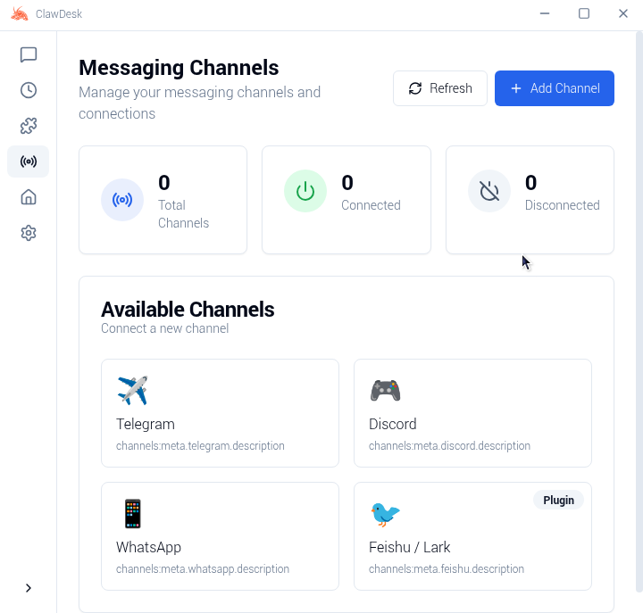
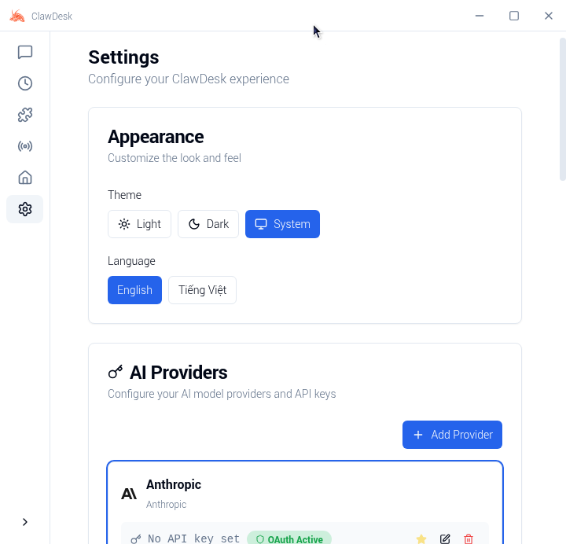

<p align="center">
  
</p>

<h1 align="center">ClawDesk</h1>

<p align="center">
  <strong>Giao diện Desktop cho Trợ lý AI OpenClaw</strong>
</p>

<p align="center">
  <a href="#tính-năng">Tính năng</a> •
  <a href="#tại-sao-chọn-clawdesk">Tại sao chọn ClawDesk</a> •
  <a href="#bắt-đầu">Bắt đầu</a> •
  <a href="#kiến-trúc">Kiến trúc</a> •
  <a href="#phát-triển">Phát triển</a> •
  <a href="#đóng-góp">Đóng góp</a>
</p>

<p align="center">
  
  
  
  <a href="https://discord.com/invite/84Kex3GGAh" target="_blank">
  
  </a>
  
  
</p>

<p align="center">
  <a href="README.md">English</a> | Tiếng Việt
</p>

---

## Tổng quan

**ClawDesk** là cầu nối giữa các trợ lý AI mạnh mẽ và người dùng hàng ngày. Được xây dựng trên nền tảng [OpenClaw](https://github.com/OpenClaw), nó biến việc điều phối AI qua dòng lệnh thành trải nghiệm desktop trực quan, đẹp mắt — không cần sử dụng terminal.

Dù bạn đang tự động hóa quy trình làm việc, quản lý các kênh AI, hay lên lịch các tác vụ thông minh, ClawDesk cung cấp giao diện bạn cần để khai thác hiệu quả các trợ lý AI.

ClawDesk được cấu hình sẵn với các nhà cung cấp mô hình theo best practice và hỗ trợ gốc Windows cũng như cài đặt đa ngôn ngữ. Tất nhiên, bạn cũng có thể tinh chỉnh cấu hình nâng cao thông qua **Cài đặt → Nâng cao → Chế độ nhà phát triển**.

---
## Ảnh chụp màn hình

<p align="center">
  
</p>

<p align="center">
  
</p>

<p align="center">
  
</p>

<p align="center">
  
</p>

<p align="center">
  
</p>

<p align="center">
  
</p>

---

## Tại sao chọn ClawDesk

Xây dựng trợ lý AI không nên đòi hỏi phải thành thạo dòng lệnh. ClawDesk được thiết kế với triết lý đơn giản: **công nghệ mạnh mẽ xứng đáng có một giao diện tôn trọng thời gian của bạn.**

| Thách thức | Giải pháp ClawDesk |
|-----------|----------------|
| Cài đặt CLI phức tạp | Cài đặt một click với hướng dẫn thiết lập từng bước |
| Tệp cấu hình | Cài đặt trực quan với xác thực thời gian thực |
| Quản lý tiến trình | Tự động quản lý vòng đời gateway |
| Nhiều nhà cung cấp AI | Bảng cấu hình nhà cung cấp thống nhất |
| Cài đặt kỹ năng/plugin | Cửa hàng kỹ năng và quản lý tích hợp sẵn |

### OpenClaw bên trong

ClawDesk được xây dựng trực tiếp trên lõi **OpenClaw** chính thức. Thay vì yêu cầu cài đặt riêng, chúng tôi nhúng runtime vào ứng dụng để mang đến trải nghiệm liền mạch "sẵn sàng sử dụng".

Chúng tôi cam kết duy trì đồng bộ chặt chẽ với dự án OpenClaw gốc, đảm bảo bạn luôn có quyền truy cập vào các tính năng mới nhất, cải thiện độ ổn định và tương thích hệ sinh thái từ các bản phát hành chính thức.

---

## Tính năng

### 🎯 Không rào cản cấu hình
Hoàn thành toàn bộ quá trình thiết lập — từ cài đặt đến tương tác AI đầu tiên — thông qua giao diện đồ họa trực quan. Không cần lệnh terminal, không cần tệp YAML, không cần tìm kiếm biến môi trường.

### 💬 Giao diện trò chuyện thông minh
Giao tiếp với trợ lý AI qua trải nghiệm chat hiện đại. Hỗ trợ nhiều ngữ cảnh hội thoại, lịch sử tin nhắn và hiển thị nội dung phong phú với Markdown.

### 📡 Quản lý đa kênh
Cấu hình và giám sát nhiều kênh AI cùng lúc. Mỗi kênh hoạt động độc lập, cho phép bạn chạy các trợ lý chuyên biệt cho các tác vụ khác nhau.

### ⏰ Tự động hóa theo lịch
Lên lịch các tác vụ AI chạy tự động. Xác định trigger, đặt khoảng thời gian, và để trợ lý AI của bạn hoạt động liên tục mà không cần can thiệp thủ công.

### 🧩 Hệ thống kỹ năng mở rộng
Mở rộng trợ lý AI với các kỹ năng có sẵn. Duyệt, cài đặt và quản lý kỹ năng qua bảng kỹ năng tích hợp — không cần trình quản lý gói.

### 🔐 Tích hợp nhà cung cấp an toàn
Kết nối nhiều nhà cung cấp AI (OpenAI, Anthropic, và nhiều hơn) với thông tin xác thực được lưu trữ an toàn trong keychain hệ thống.

### 🌙 Chủ đề tự thích ứng
Chế độ sáng, chế độ tối, hoặc đồng bộ theo hệ thống. ClawDesk tự động thích ứng với tùy chọn của bạn.

---

## Bắt đầu

### Yêu cầu hệ thống

- **Hệ điều hành**: macOS 11+, Windows 10+, hoặc Linux (Ubuntu 20.04+)
- **Bộ nhớ**: Tối thiểu 4GB RAM (khuyến nghị 8GB)
- **Dung lượng**: 1GB dung lượng đĩa trống

### Cài đặt

#### Bản dựng sẵn (Khuyến nghị)

Tải bản phát hành mới nhất cho nền tảng của bạn từ trang [Releases](https://github.com/Neurons-ai/ClawDesk/releases).

#### Xây dựng từ mã nguồn

```bash
# Clone repository
git clone https://github.com/Neurons-ai/ClawDesk.git
cd ClawDesk

# Khởi tạo dự án
pnpm run init

# Khởi động chế độ phát triển
pnpm dev
```

### Lần khởi động đầu tiên

Khi bạn khởi động ClawDesk lần đầu, **Trình hướng dẫn thiết lập** sẽ dẫn bạn qua các bước:

1. **Ngôn ngữ & Khu vực** – Cấu hình ngôn ngữ ưa thích
2. **Nhà cung cấp AI** – Nhập khóa API cho các nhà cung cấp được hỗ trợ
3. **Gói kỹ năng** – Chọn kỹ năng cấu hình sẵn cho các trường hợp sử dụng phổ biến
4. **Xác minh** – Kiểm tra cấu hình trước khi vào giao diện chính

---

## Kiến trúc

ClawDesk sử dụng **kiến trúc hai tiến trình** tách biệt giao diện và hoạt động runtime AI:

```
┌─────────────────────────────────────────────────────────────────┐
│                        Ứng dụng ClawDesk Desktop                     │
│                                                                  │
│  ┌────────────────────────────────────────────────────────────┐  │
│  │              Tiến trình chính Electron                      │  │
│  │  • Quản lý vòng đời cửa sổ & ứng dụng                     │  │
│  │  • Giám sát tiến trình Gateway                              │  │
│  │  • Tích hợp hệ thống (tray, thông báo, keychain)           │  │
│  │  • Điều phối cập nhật tự động                               │  │
│  └────────────────────────────────────────────────────────────┘  │
│                              │                                    │
│                              │ IPC                                │
│                              ▼                                    │
│  ┌────────────────────────────────────────────────────────────┐  │
│  │              Tiến trình React Renderer                      │  │
│  │  • UI hiện đại dựa trên component (React 19)               │  │
│  │  • Quản lý state với Zustand                                │  │
│  │  • Giao tiếp WebSocket thời gian thực                       │  │
│  │  • Hiển thị Markdown phong phú                              │  │
│  └────────────────────────────────────────────────────────────┘  │
└──────────────────────────────┬──────────────────────────────────┘
                               │
                               │ WebSocket (JSON-RPC)
                               ▼
┌─────────────────────────────────────────────────────────────────┐
│                     OpenClaw Gateway                             │
│                                                                  │
│  • Runtime & điều phối trợ lý AI                                │
│  • Quản lý kênh nhắn tin                                        │
│  • Môi trường thực thi kỹ năng/plugin                           │
│  • Lớp trừu tượng nhà cung cấp                                  │
└─────────────────────────────────────────────────────────────────┘
```

### Nguyên tắc thiết kế

- **Cách ly tiến trình**: Runtime AI hoạt động trong tiến trình riêng biệt, đảm bảo UI phản hồi nhanh ngay cả khi tính toán nặng
- **Phục hồi mượt mà**: Logic kết nối lại với exponential backoff tích hợp sẵn, tự động xử lý lỗi tạm thời
- **Lưu trữ an toàn**: Khóa API và dữ liệu nhạy cảm sử dụng cơ chế lưu trữ an toàn gốc của hệ điều hành
- **Hot Reload**: Chế độ phát triển hỗ trợ cập nhật UI tức thì mà không cần khởi động lại gateway

---

## Trường hợp sử dụng

### 🤖 Trợ lý AI cá nhân
Cấu hình trợ lý AI đa năng có thể trả lời câu hỏi, soạn email, tóm tắt tài liệu và hỗ trợ các tác vụ hàng ngày — tất cả từ giao diện desktop gọn gàng.

### 📊 Giám sát tự động
Thiết lập trợ lý theo lịch để giám sát nguồn tin tức, theo dõi giá cả, hoặc theo dõi sự kiện cụ thể. Kết quả được gửi đến kênh thông báo ưa thích của bạn.

### 💻 Năng suất cho nhà phát triển
Tích hợp AI vào quy trình phát triển. Sử dụng trợ lý để review code, tạo tài liệu, hoặc tự động hóa các tác vụ lập trình lặp đi lặp lại.

### 🔄 Tự động hóa quy trình
Kết nối nhiều kỹ năng để tạo pipeline tự động hóa phức tạp. Xử lý dữ liệu, chuyển đổi nội dung, và kích hoạt hành động — tất cả được điều phối trực quan.

---

## Phát triển

### Yêu cầu

- **Node.js**: 22+ (khuyến nghị LTS)
- **Trình quản lý gói**: pnpm 9+ (khuyến nghị) hoặc npm

### Cấu trúc dự án

```
ClawDesk/
├── electron/              # Tiến trình chính Electron
│   ├── main/             # Khởi tạo ứng dụng, quản lý cửa sổ
│   ├── gateway/          # Quản lý tiến trình OpenClaw Gateway
│   ├── preload/          # Script cầu nối IPC an toàn
│   └── utils/            # Tiện ích (lưu trữ, xác thực, đường dẫn)
├── src/                   # Tiến trình React Renderer
│   ├── components/       # Component UI tái sử dụng
│   │   ├── ui/          # Component cơ sở (shadcn/ui)
│   │   ├── layout/      # Component bố cục (sidebar, header)
│   │   └── common/      # Component dùng chung
│   ├── pages/           # Các trang ứng dụng
│   │   ├── Setup/       # Trình hướng dẫn thiết lập
│   │   ├── Dashboard/   # Bảng điều khiển chính
│   │   ├── Chat/        # Giao diện trò chuyện AI
│   │   ├── Channels/    # Quản lý kênh
│   │   ├── Skills/      # Duyệt & quản lý kỹ năng
│   │   ├── Cron/        # Tác vụ định kỳ
│   │   └── Settings/    # Bảng cấu hình
│   ├── stores/          # Zustand state store
│   ├── lib/             # Tiện ích frontend
│   └── types/           # Định nghĩa kiểu TypeScript
├── resources/            # Tài nguyên tĩnh (icon, hình ảnh)
├── scripts/              # Script build & tiện ích
└── tests/               # Bộ test
```

### Các lệnh có sẵn

```bash
# Phát triển
pnpm dev                  # Khởi động với hot reload
pnpm dev:electron         # Khởi động Electron trực tiếp

# Chất lượng code
pnpm lint                 # Chạy ESLint
pnpm lint:fix             # Tự động sửa lỗi
pnpm typecheck            # Kiểm tra TypeScript

# Testing
pnpm test                 # Chạy unit test
pnpm test:watch           # Chế độ theo dõi
pnpm test:coverage        # Tạo báo cáo coverage
pnpm test:e2e             # Chạy Playwright E2E test

# Build & Đóng gói
pnpm build                # Build production đầy đủ
pnpm package              # Đóng gói cho nền tảng hiện tại
pnpm package:mac          # Đóng gói cho macOS
pnpm package:win          # Đóng gói cho Windows
pnpm package:linux        # Đóng gói cho Linux
```

### Công nghệ sử dụng

| Tầng | Công nghệ |
|------|-----------|
| Runtime | Electron 40+ |
| UI Framework | React 19 + TypeScript |
| Styling | Tailwind CSS + shadcn/ui |
| State | Zustand |
| Build | Vite + electron-builder |
| Testing | Vitest + Playwright |
| Animation | Framer Motion |
| Icons | Lucide React |

---

## Đóng góp

Chúng tôi hoan nghênh đóng góp từ cộng đồng! Dù là sửa lỗi, tính năng mới, cải thiện tài liệu hay bản dịch — mọi đóng góp đều giúp ClawDesk trở nên tốt hơn.

### Cách đóng góp

1. **Fork** repository
2. **Tạo** nhánh tính năng (`git checkout -b feature/tinh-nang-moi`)
3. **Commit** các thay đổi với mô tả rõ ràng
4. **Push** lên nhánh của bạn
5. **Tạo** Pull Request

### Hướng dẫn

- Tuân theo code style hiện có (ESLint + Prettier)
- Viết test cho tính năng mới
- Cập nhật tài liệu khi cần
- Giữ commit atomic và mô tả rõ ràng

---

## Lời cảm ơn

ClawDesk được xây dựng trên nền tảng các dự án mã nguồn mở xuất sắc:

- [OpenClaw](https://github.com/OpenClaw) – Runtime trợ lý AI
- [Electron](https://www.electronjs.org/) – Framework desktop đa nền tảng
- [React](https://react.dev/) – Thư viện UI component
- [shadcn/ui](https://ui.shadcn.com/) – Component được thiết kế đẹp mắt
- [Zustand](https://github.com/pmndrs/zustand) – Quản lý state nhẹ

---

## Cộng đồng

Tham gia cộng đồng của chúng tôi để kết nối với người dùng khác, nhận hỗ trợ và chia sẻ trải nghiệm.

[](https://discord.gg/SdUWHXZ4Dg)

---

## Giấy phép

ClawDesk được phát hành theo [Giấy phép MIT](LICENSE). Bạn được tự do sử dụng, chỉnh sửa và phân phối phần mềm này.

---

<p align="center">
  <sub>Được xây dựng với ❤️ bởi đội ngũ Neurons AI</sub>
</p>
